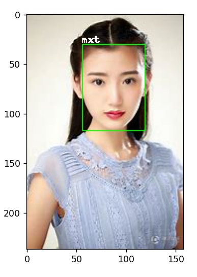

对MTCNN和InceptionResnetV1的源码做了稍微的修改, 主要包括两个方面:
    1. 使得mtcnn的forward函数能够返回识别到的脸部的box信息. 在MTCNN源码中所有的修改部分均进行了备注, 可以直接搜索 '修改' 进行查找

    2. 对IncepResnetV1源码主要进行了路径修改, 使得模型能够找到权重文件 ==> 这个主要是因为从github上面下载权重比较缓慢而且容易出错
        在 C:\Users\14060\.cache\torch\checkpoints 路径下放一个权重文件20180402-114759-vggface2.pt
        在 D:\Apps\Anaconda3\envs\deepl\Lib\site-packages\facenet_pytorch\data 路径下也放同一个权重文件 20180402-114759-vggface2.pt
        在源码中: 
            path = os.path.dirname(os.path.dirname(__file__))
            path = os.path.join(path, 'data', '20180402-114759-vggface2.pt')

# 1. 构造MTCNN和InceptionResnetV1对象
mtcnn = MTCNN(keep_all=True) # 可以返回多个人脸
resnet = InceptionResnetV1(pretrained='vggface2').eval()

# 2. 读取图像

# 3. 获取人脸
face_cropped, probs, boxes = mtcnn(img, save_path=None, return_prob=True) # 这里可以直接获取到人脸的box信息是因为我们对源码做了修改
print(f'get face with probability {probs}')
print(f'boxes = {boxes}')

# 4. 构造人脸特征
face_embeddings = []
for item in face_cropped:
    face_embedding = resnet(item.unsqueeze(0))
    face_embeddings.append(face_embedding)

# 结果展示
我们只识别毛晓彤(mxt)和欧阳娜娜(nana)两个人. 剩下是所有都表示为other

